# load-balancing

## Introduction to load balancing and nginx

Load balancing means efficiently distributing incoming network traffic equally to differnt server instances.

Load balancing directs and controls internet traffic between the application server and their visitor or clients. It improves an application availability, scalabilty, security and performance.

Load balancer sits between the clients and backend service. It receives request from the client and based on the incoming request, it passes the request on to upstream servers or instances which are cable of fulfilling that specific request.

__How does Nginx work?__ 

Nginx acts as a single entry point to a distributed web application working on multiple separate servers.

__setting up a basic load balancer__

We are going to create two Ec2 instances.

 
We will open port 8000 to be running on our webservers to allow traffic from anywhere. To do this we need to add a rule to the security group of each of our webservers. 

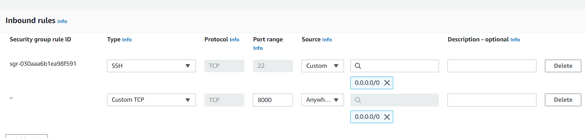

Let's connect to each of the webservers via ssh.

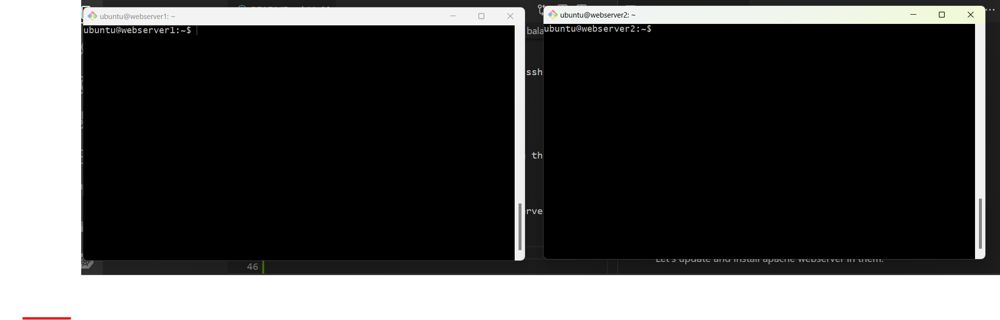

Let's update and install apache webserver in them.

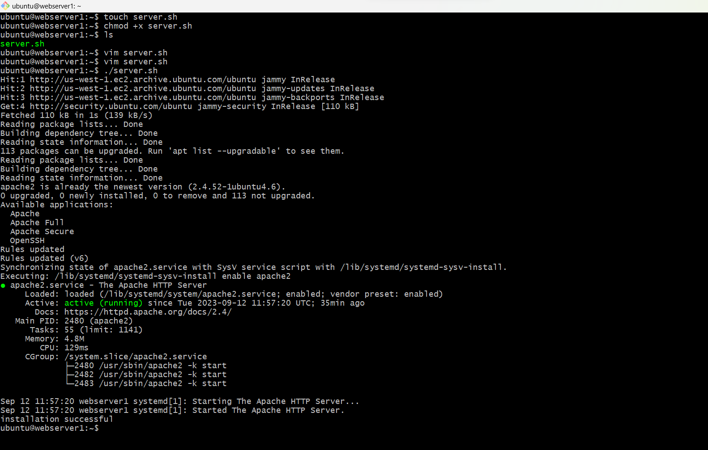

__Configure Apache to serve a page showing the IP address.__

we will configure Apache webserver to serve content on port 8000 instead of its default which is port 80.

`sudo vi /etc/apache2/port.conf`

Result:

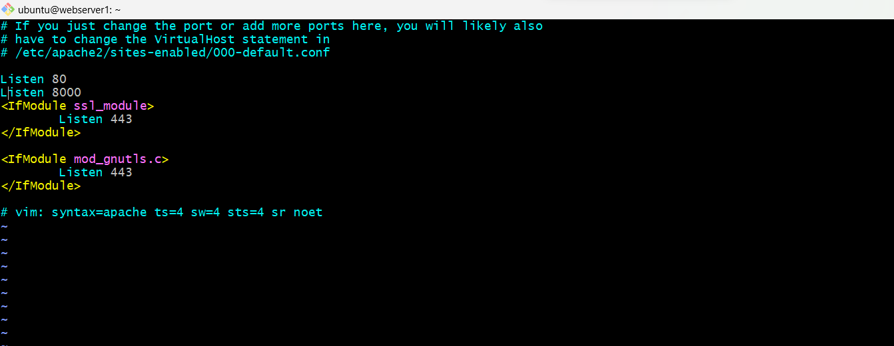

Next open the file and change port 80 on the virtualhost to port 8000 on both servers. 

`/etc/apache2/sites-available/000-default.conf`

Result:

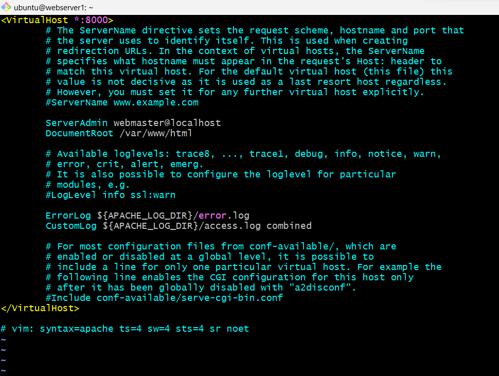

Restart apache to load the new configuration on both servers.

`sudo systemctl restart apache2`

Then we will create a new index.html file on both servers.

`sudo vi index.html`

Result:

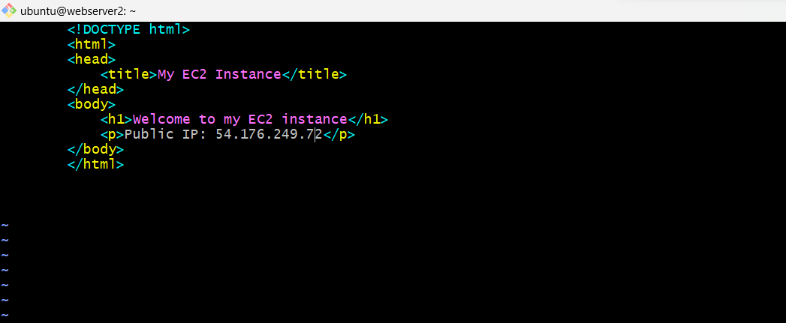

Change file ownership of the index.html file on both web servers.

`sudo chown www-data:www-data ./index.html`

Replace the default html file with our new file on both webservers.  

`sudo cp -f ./index.html /var/www/html/index.html`

Restart the webserver to load the new configuration on both servers.

`sudo systemctl restart apache2`

Finally update the default page of both webservers to display their public IP address.

__Configure Nginx as a load balancer__

Now let's launch one more Ec2 instance for setting up nginx.

_Create another instance_ 

Result:

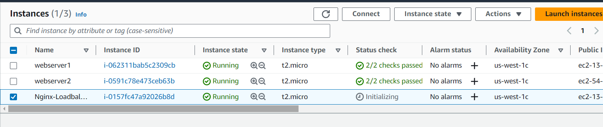

Open http port 80 security group

Result:

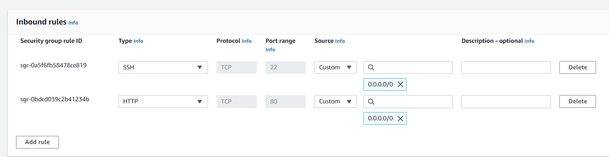

Connect to nginx IP address via ssh.

Result:

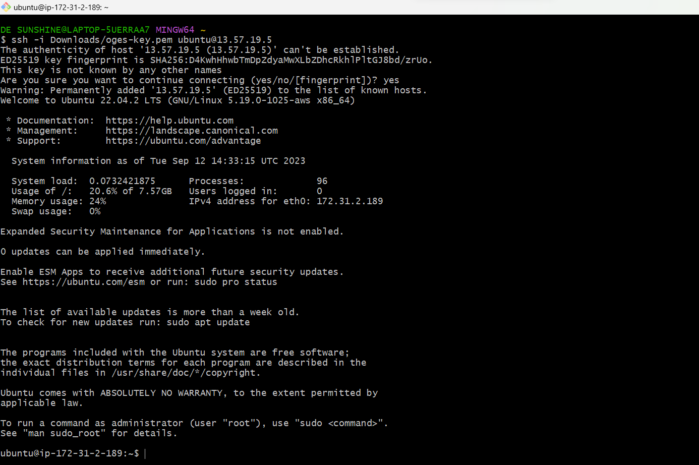

Let's update and install Nginx

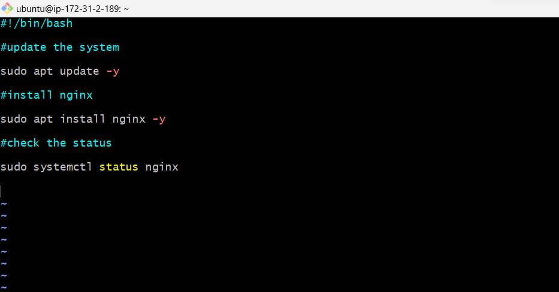

The next step is to define the servers that will receive traffic from the load balancer. These servers are known as __upstream servers.__ 

You can define them in the Nginx configuration file `/etc/nginx/nginx.conf`

Open the file in a text editor and add the following code.

`sudo vim /etc/nginx/nginx.conf`

Configure nginx to route traffic to my back-end Apache servers.

Result:

This is a very basic nginx configuration with a couple of blocks 

My nginx server going to listen on port 80

The location / block specifies the URL path that should be routed to the upstream servers. The proxy_pass directive tells Nginx to forward incoming requests to the __“backend”__ upstream group we defined earlier.

__Let's break down the configuration:__

__The events block {}__ is defined first and left empty, as it usually doesn't require specific settings in basic configurations.

__upstream backend:__ This block defines a group of upstream servers called __"backend."__ This is where you list the backend servers that Nginx will distribute incoming requests to.

__server 13.57.37.191:8000; and server 54.176.249.72:8000;__ These lines specify the IP addresses and ports of the backend servers. Nginx will load-balance requests between these two servers.

__server { ... }:__ This block defines the main configuration for the Nginx server. It listens on port 80 for incoming HTTP requests.

__location / { ... }:__ The location / block specifies the URL path that should be routed to the upstream servers. The proxy_pass directive tells Nginx to forward incoming requests to the __“backend”__ upstream group we defined earlier.

__proxy_pass http://backend;:__ This line is crucial. It tells Nginx to forward incoming requests to one of the servers listed in the "backend" upstream group. Nginx will distribute requests in a round-robin fashion to these servers.

Test your configuration

`sudo nginx -t`

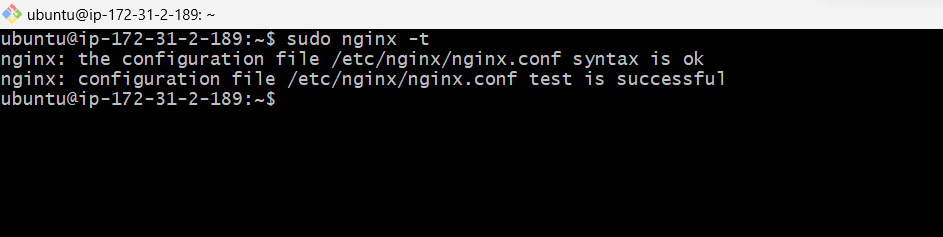

__Restart nginx__

Finally, if there are no errors restart Nginx to apply the changes to the configuration file.

`sudo systemctl restart nginx`

__Testing the load balancer__

Go to the nginx-loadbalancer instance, copy the IP address and paste on your browser, you will see the same webpages served by the webservers.

Results:

Then you refresh , you are sending requests to nginx that is in turn forwarding traffic to one of these two Ec2 instances.

When you keep refreshing it, you will observe it is kind of doing a round-robin and distributing the traffic to these back-end Apache web servers.

